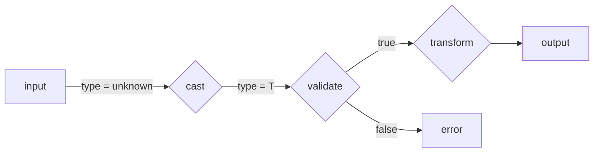

# Safen <a href="https://github.com/denostack"></a>

<p>
  <a href="https://github.com/denostack/safen/actions"></a>
  <a href="https://codecov.io/gh/denostack/safen"></a>
  
  
  <br />
  <a href="https://deno.land/x/safen"></a>
  <a href="https://www.npmjs.com/package/safen"></a>
  <a href="https://npmcharts.com/compare/safen?minimal=true"></a>
</p>

Safen is a high-performance validation and sanitization library with easy type
inference. Its syntax is similar to TypeScript interface, making it easy to
create validation rules.

https://user-images.githubusercontent.com/4086535/203831205-8b3481cb-bb8d-4f3c-9876-e41adb6855fd.mp4

## Installation

**Node**

```bash
npm install safen
```

**Deno**

```ts
import {
  s, // sanitize,
  v, // validate,
} from "https://deno.land/x/safen/mod.ts";
```

## Basic Usage

**Create Validate Fn**

```ts
import { v } from "https://deno.land/x/safen/mod.ts";

const validate = v(String); // now, validate: (data: unknown) => data is string

const input = {} as unknown;
if (validate(input)) {
  // now input is string!
}
```

**Create Sanitize Fn**

```ts
import { s } from "https://deno.land/x/safen/mod.ts";

const sanitize = s(String); // now, sanitize: (data: unknown) => string

const input = {} as unknown; // some unknown value

sanitize("something" as unknown); // return "something"
sanitize(null as unknown); // throw InvalidValueError
```

## Types

```ts
// Primitive Types
const validate = v(String); // (data: unknown) => data is string
const validate = v(Number); // (data: unknown) => data is number
const validate = v(Boolean); // (data: unknown) => data is boolean
const validate = v(BigInt); // (data: unknown) => data is bigint
const validate = v(Symbol); // (data: unknown) => data is symbol

// Literal Types
const validate = v("foo"); // (data: unknown) => data is "foo"
const validate = v(1024); // (data: unknown) => data is 1024
const validate = v(true); // (data: unknown) => data is true
const validate = v(2048n); // (data: unknown) => data is 2048n
const validate = v(null); // (data: unknown) => data is null
const validate = v(undefined); // (data: unknown) => data is undefined

// Special
const validate = v(v.any()); // (data: unknown) => data is any
const validate = v(Array); // (data: unknown) => data is any[]

// Object
const Point = { x: Number, y: Number };
const validate = v({ p1: Point, p2: Point }); // (data: unknown) => data is { p1: { x: number, y: number }, p2: { x: number, y: number } }

// Union
const validate = v(v.union([String, Number])); // (data: unknown) => data is string | number

// Array
const validate = v([String]); // (data: unknown) => data is string[]
const validate = v([v.union([String, Number])]); // (data: unknown) => data is (string | number)[]
```

## Decorator

Decorators do not affect type inference, but do affect additional validation and
data transformation.

**Step1. Basic Sanitize**

```ts
const sanitize = s(s.union([
  String,
  null,
]));

sanitize("hello world!"); // return "hello world!"
sanitize("  hello world!  "); // return "  hello world!  "
sanitize("    "); // return "    "
sanitize(null); // return null
```

**Step2. Add trim decorator**

```ts
const sanitize = s(s.union([
  s.decorate(String, (d) => d.trim()),
  null,
]));

sanitize("hello world!"); // return "hello world!"
sanitize("  hello world!  "); // return "hello world!"
sanitize("    "); // return ""
sanitize(null); // return null
```

**Step3. Add emptyToNull decorator**

```ts
const sanitize = s(
  s.decorate(
    s.union([
      s.decorate(String, (d) => d.trim()),
      null,
    ]),
    (d) => d.emptyToNull(),
  ),
);

sanitize("hello world!"); // return "hello world!"
sanitize("  hello world!  "); // return "hello world!"
sanitize("    "); // return null
sanitize(null); // return null
```

### Defined Decorators

| Decorator                 | Validate | Transform | Type               | Description                                                                         |
| ------------------------- | -------- | --------- | ------------------ | ----------------------------------------------------------------------------------- |
| `alpha`                   | ✅       |           | `string`           | contains only letters([a-zA-Z]).                                                    |
| `alphanum`                | ✅       |           | `string`           | contains only letters and numbers([a-zA-Z0-9])                                      |
| `ascii`                   | ✅       |           | `string`           | contains only ascii characters.                                                     |
| `base64`                  | ✅       |           | `string`           | Base64.                                                                             |
| `between(min, max)`       | ✅       |           | `string`, `number` | value is between `{min}` and `{max}`. (ex) `between("aaa","zzz")`, `between(1,100)` |
| `ceil`                    |          | ✅        | `number`           | Math.ceil. (ref. `floor`, `round`)                                                  |
| `creditcard`              | ✅       |           | `string`           | valid Credit Card number. cf. `0000-0000-0000-0000`                                 |
| `dateformat`              | ✅       |           | `string`           | valid Date string(RFC2822, ISO8601). cf. `2018-12-25`, `12/25/2018`, `Dec 25, 2018` |
| `email`                   | ✅       |           | `string`           | valid E-mail string.                                                                |
| `emptyToNull`             |          | ✅        | `string or null`   | empty string(`""`) to null                                                          |
| `floor`                   |          | ✅        | `number`           | Math.floor. (ref. `ceil`, `round`)                                                  |
| `hexcolor`                | ✅       |           | `string`           | valid Hex Color string. cf. `#ffffff`                                               |
| `ip(version = null)`      | ✅       |           | `string`           | valid UUID.<br />version is one of `null`(both, default), `v4`, and `v6`.           |
| `json`                    | ✅       |           | `string`           | valid JSON.                                                                         |
| `length(size)`            | ✅       |           | `string`, `any[]`  | length is `{size}`.                                                                 |
| `lengthBetween(min, max)` | ✅       |           | `string`, `any[]`  | length is between `{min}` and `{max}`.                                              |
| `lengthMax(max)`          | ✅       |           | `string`, `any[]`  | length is less than `{max}`.                                                        |
| `lengthMin(min)`          | ✅       |           | `string`, `any[]`  | length is greater than `{min}`.                                                     |
| `lowercase`               | ✅       |           | `string`           | lowercase.                                                                          |
| `macaddress`              | ✅       |           | `string`           | valid Mac Address.                                                                  |
| `max(max)`                | ✅       |           | `string`, `number` | value is less than `{min}`.                                                         |
| `min(min)`                | ✅       |           | `string`, `number` | value is greater than `{max}`.                                                      |
| `port`                    | ✅       |           | `number`           | valid PORT(0-65535).                                                                |
| `re`                      | ✅       |           | `string`           | match RegExp.                                                                       |
| `round`                   |          | ✅        | `number`           | Math.round. (ref. `ceil`, `floor`)                                                  |
| `stringify`               |          | ✅        | `string`           | cast to string                                                                      |
| `toLower`                 |          | ✅        | `string`           | change to lower case.                                                               |
| `toUpper`                 |          | ✅        | `string`           | change to upper case.                                                               |
| `trim`                    |          | ✅        | `string`           | trim.                                                                               |
| `uppercase`               | ✅       |           | `string`           | uppercase.                                                                          |
| `url`                     | ✅       |           | `string`           | valid URL.                                                                          |
| `uuid(version = null)`    | ✅       |           | `string`           | valid UUID.<br />version is one of `null`(default), `v3`, `v4`, and `v5`.           |

## Custom Decorator



```ts
interface Decorator<T> {
  name: string;
  cast?(v: unknown): T;
  validate?(v: T): boolean;
  transform?(v: T): T;
}
```

The `cast` function is invoked at the beginning of the data processing pipeline,
before the `validate` and `transform` functions. The purpose of the `cast`
function is to ensure that the data is in the right type before being processed
further.

This is an example of a cast-only function:

```ts
const decorator: Decorator<string> = {
  name: "json_string",
  cast: (v) => JSON.stringify(v),
};
```

Once the data has been casted, the `validate` function is called to verify the
content and format of the data. This function ensures that the data is valid and
meets the specified criteria before being processed further.

The `transform` function, on the other hand, is invoked only after the
validation function returns a `true` result. The `transform` function then
processes the data according to the specified rules and criteria.

Therefore, the `cast`, `validate`, and `transform` functions work together to
ensure that the data is in the right format, is valid, and is properly
processed.

## Benchmark

Please see [benchmark results](.benchmark).

## Old Version Docs

- [1.x](https://github.com/denostack/safen/tree/1.x)
- [2.x](https://github.com/denostack/safen/tree/1.x)
